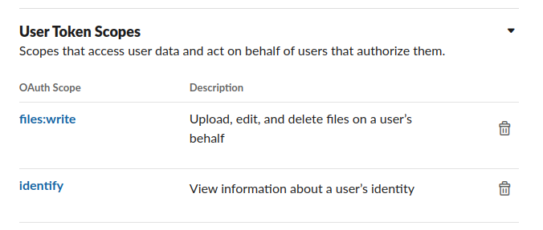

# Introduction

This project is inspired on [@abnormal_crypto](https://twitter.com/abnormal_crypto).
I wanted to forward messages to slack, rather than receiving mass notifications on Twitter, also I want to focus
on fewer trading pairs, since there is no open source alternative for @abnormal_crypto I challenged myself to
write one.

The number of notifications triggered depends heavily on the settings, if we stick to strict x2 or more volume change
we would receive too many notifications, mainly from illiquid markets because often there is a moment with very little
volume, say 500$, then next tick the volume has only to grow to 5000$ to trigger our bot with a x10 volume, to avoid
this, we can configure many settings(min % price change, min USDT volume, etc.) to filter the noise.

As of now, the application works, there are some features still to be implemented and some code that is either not
used or not honored(some settings), with time this will be improved.

## Features

- Support for Binance Spot and Binance USD-m futures
- Send volume alerts to Slack
- Open source, you are free to change the code as you need.

## Getting Started

For now the app only supports reporting to Slack, in the future I may add support for Discord and Telegram.

- Get a slack token, this YouTube tutorial shows how to get such
  token https://www.youtube.com/watch?v=h94FK8h1OJU&ab_channel=NoCodeAPI
- Give the appropriate Scopes to the token (make sure it has "files:write" scope and "identify"):
  
- Creating a webhook, not sure why, but at the beginning it was not working properly (messages were forwarded to the
  wrong channel), once I created a webhook for the channel I was interested in (`trading_volume_alerts`) it fixed
  the problem.
  This video shows how to create a Slack
  Webhook https://www.youtube.com/watch?v=6NJuntZSJVA&ab_channel=BoyumITSolutions

The application needs two environment variables so it can send notifications to Slack:

- SLACK_ACCESS_TOKEN: The slack access token with `file:write` and `identify` scopes, it is needed to use
  the `files.upload`  Slack API.
- SLACK_CHANNEL_ID: The channel id where to send the alert. Channel Id is the last part in the channel's link,
  as described
  in [https://help.socialintents.com/article/148-how-to-find-your-slack-team-id-and-slack-channel-id](https://help.socialintents.com/article/148-how-to-find-your-slack-team-id-and-slack-channel-id)]

You can either preconfigure these two environment variables beforehand, or write them down in a `.env` file then run
the application indicating the location of such file:

```bash
python3 main.py -e .env
```

In the future this application will take a config file and parse it, but for now, you would need to configure
it harcoding settings in the code. For instance, if you want to monitor only BTC/USDT and ETH/USDT you would remove all
other trading pairs in config.py and let it as is:

```python
trading_symbols = [
    {'base': 'BTC', 'quote': 'USDT'},
    {'base': 'ETH', 'quote': 'USDT'},
]
```

Accordingly, if you want more assets, add them in the `trading_symbols` list.
All other settings can be changed either on the `core/config.py` file or on `exchanges/__init__.py` on the
BaseKLineProcessor's constructor.

After you cloned the repo, made the appropriate changes and you are ready to launch the bot, create
a python virtual environment and install dependencies:

```bash
$ python3 -m venv my_venv
$ # activate the virtual environment
$ source /venv/bin/activate
# If you are using fish terminal then activate with this instead 
$ source venv/bin/activate.fish
# Make sure the environment is now activated
$ which python3
# It outputs ..<something>../venv/bin/python3
# Install dependencies
$ pip3 install -r requirements.txt
```

Now just run it:

```bash
$ python3 ./main.py -e ./.env
```

# TODO:

Things I need to implement, feel free to implement any feature and send a pull request.

- Find a package to colorize output using a simple API, as of now I am using some dirty tricks to achieve that goal.
- Binance documentation indicates that Websocket connections are closed after 24h, I should implement some reconnection
  code
- Integrate a logging framework.
- Date offsets are not taken into account, which may lead to charts different than the official charts (only if settings
  are changed to use different timeframes than 1min)
  for instance if our first cached candle is from 10:01 and we aggregate the 1min candles into 5min, then the first
  candle
  would go from 10:01 to 10:06 rather than 10:00 to 10:05, I should implement code to fit it.
  If however I use 1min candles for everything, then there is no need to fit anything.

# References:

This project is the result of reading and stealing content/code from plenty of resources, thanks to everyone
for the help:

- https://github.com/binance/binance-spot-api-docs/blob/master/web-socket-streams.md#klinecandlestick-streams
- https://developers.binance.com/docs/binance-trading-api/futures#klinecandlestick-data
- https://binance-docs.github.io/apidocs/spot/en/
- https://docs.python.org/3/library/datetime.html
- https://stackoverflow.com/questions/12385179/how-to-send-a-multipart-form-data-with-requests-in-python
- https://api.slack.com/methods/files.upload
- https://stackoverflow.com/questions/38061267/matplotlib-graphic-image-to-base64
- https://stackoverflow.com/questions/9622163/save-plot-to-image-file-instead-of-displaying-it-using-matplotlib
- https://stackoverflow.com/questions/19231871/convert-unix-time-to-readable-date-in-pandas-dataframe
- https://api.slack.com/tutorials/tracks/getting-a-token
- https://plotly.com/python/setting-graph-size/#adjusting-height-width--margins-with-graph-objects
- https://plotly.com/python/static-image-export/
- https://www.geeksforgeeks.org/abstract-classes-in-python/
- https://stackoverflow.com/questions/287871/how-do-i-print-colored-text-to-the-terminal
- https://github.com/ccxt/ccxt/blob/master/python/ccxt/base/exchange.py#L1434
- https://github.com/Skudarilia/binance_websocket/blob/fc01f1eb3f6c009cd56a3647da858b2dcb8ed44c/src/work.py
- https://github.com/crossbario/autobahn-python/blob/master/examples/twisted/websocket/echo_variants/client_with_params.py